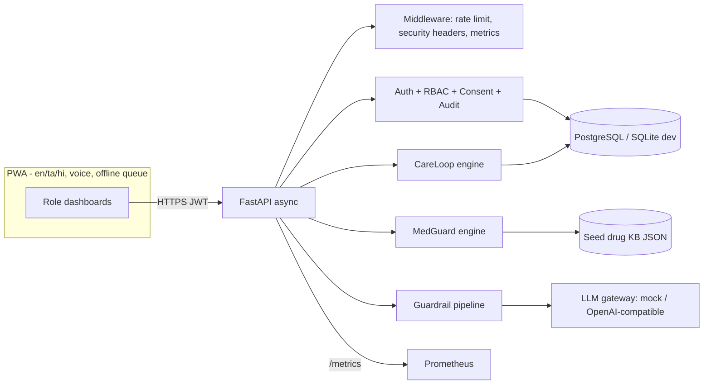
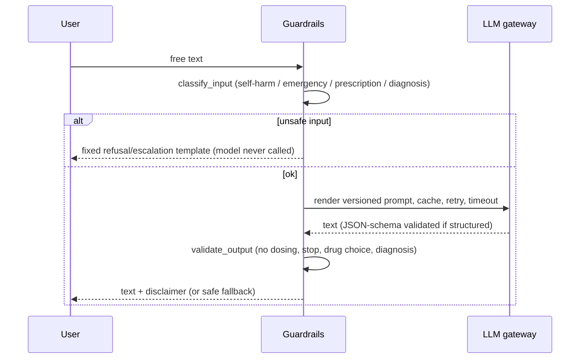
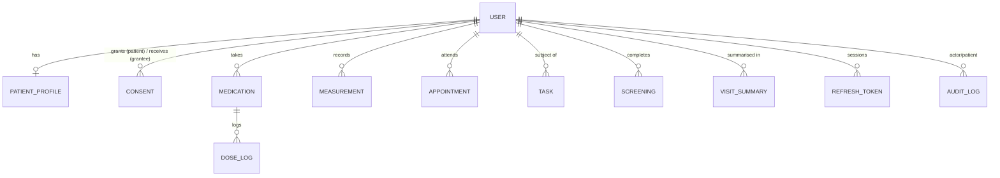

# Architecture

## Request path for any AI call

## Data model (ERD)

PHI text columns (allergies, conditions, dose text, notes, screening answers, summaries) use `EncryptedText` (Fernet). Numeric measurements stay queryable.

## Key decisions
- **Engines are pure functions** (`medguard/engine.py`, `careloop/engine.py`) so they are unit/golden tested without DB or network.
- **Every generated string goes through `ensure_safe`/`validate_output`**, including MedGuard explanations and CareLoop flags.
- **Consent model**: patient grants scopes (`medications, measurements, adherence, appointments, summary, screening`) per grantee; every access, allowed or denied, is audited; admins never read PHI.
- **LLM optional**: default offline `mock` provider is deterministic; swap via `LLM_PROVIDER=openai_compat` (OpenAI, vLLM, Ollama...).
- **Drug-knowledge ingestion design** (not implemented as code): RxNorm/openFDA/ATC loaders write to `ingredients/products/interactions` with `source`, `licence`, `retrieved_at`, `reviewed_by`; only `reviewed=true` rows may be shown as non-"unreviewed"; Indian brand maps come from licensed sources.
- **Interoperability**: `GET /patients/{id}/fhir` exports a FHIR R4 Bundle (Patient, MedicationStatement, Observation with LOINC). ABDM integration is out of scope.
